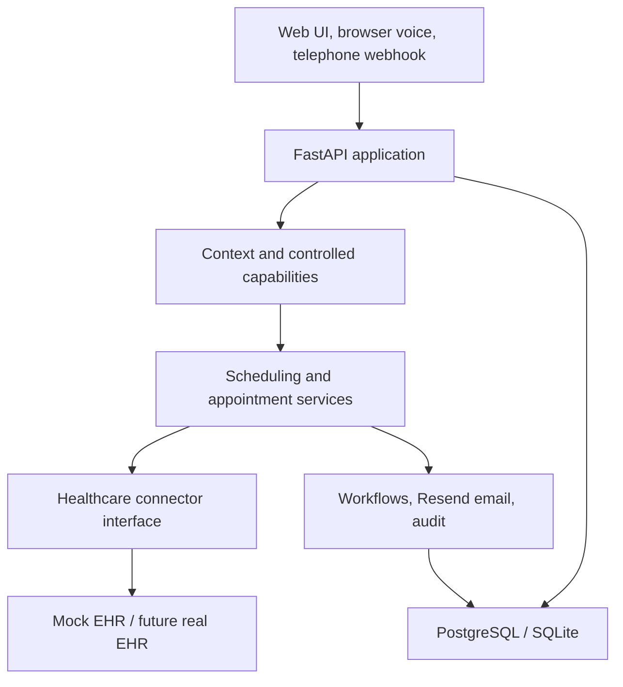
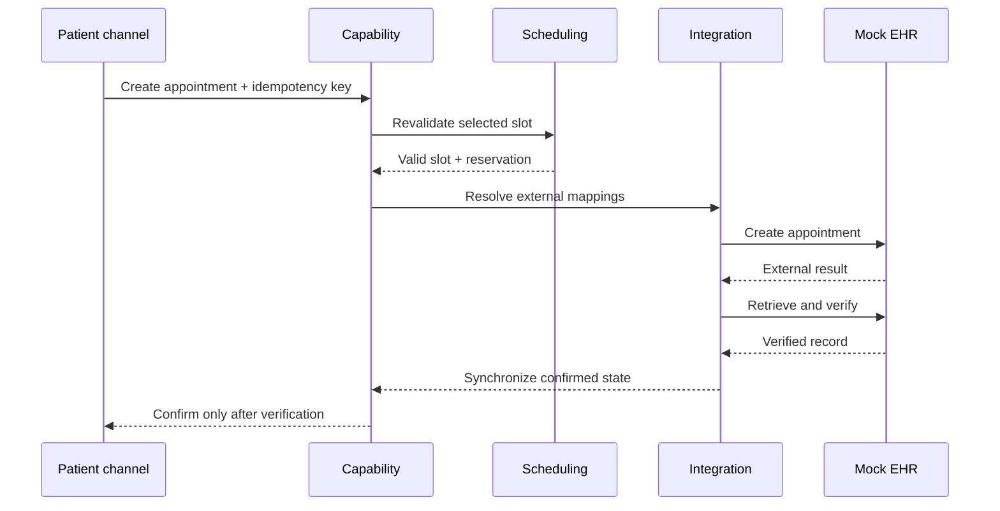

# High-Level Design

## System context

The application is a modular monolith for prototype speed while preserving service boundaries. The Mock EHR is a separate deployable service. PostgreSQL is the Compose database; SQLite remains available for zero-dependency local tests.

## Components

| Layer | Responsibility | Main implementation |
|---|---|---|
| Interfaces | REST, WebSocket, web voice, telephone events, dashboards | `app/api.py`, `frontend.py` |
| Identity/security | Authentication, roles, tenant membership, resource ownership | `app/security.py` |
| AI application | Intent/context, clarification, safety and confirmations | `app/agent_runtime.py` |
| Capabilities | Authorized, auditable AI action boundary | `app/capabilities.py` |
| Scheduling | Time-zone-aware slots, hours, blocks and collision checks | `app/scheduling.py` |
| Appointments | Transactional lifecycle, idempotency and external synchronization | `app/appointments.py` |
| Integration | Vendor-neutral result classification and Mock EHR adapter | `app/connectors.py`, `mock_ehr.py` |
| Automation | Event-triggered delayed/retryable workflows and email | `app/workflows.py`, `app/notifications.py` |
| State/data | Explicit transactional, conversation, workflow, integration and operational entities | `app/models.py` |
| Observability | Correlation, capability execution, audit, operational events and metrics | `app/telemetry.py`, operations APIs |

## Trust and tenancy model

- Every protected request resolves an authenticated `RequestContext`.
- Platform admins operate platform resources; hospital admins and doctors receive explicit hospital memberships; patients are restricted to their own patient record.
- Queries are role- and tenant-scoped. Cross-tenant private identifiers are concealed as not found.
- AI calls the same capability layer as other application clients and cannot call the EHR directly.
- Secrets enter through environment variables. Sensitive message content is not copied into operational telemetry.

## Availability and booking

## Reliability decisions

- A unique doctor/start reservation prevents double booking.
- Mutations use caller idempotency keys and payload-hash conflict detection.
- EHR writes use separate idempotency keys.
- Timeouts/unknown outcomes are searched before any safe retry.
- Unresolved operations become reconciliation records and are visible operationally.
- Workflows and notifications are idempotent and independently retryable.

## Technology rationale

FastAPI/Pydantic give typed HTTP and WebSocket interfaces; SQLAlchemy supplies an explicit portable domain model; PostgreSQL supplies transactional concurrency; Streamlit keeps role demos compact; Resend offers a small email API; browser speech keeps the voice demo credential-free; Docker Compose makes all services reproducible. These choices optimize prototype speed while retaining replaceable integration and data boundaries.
