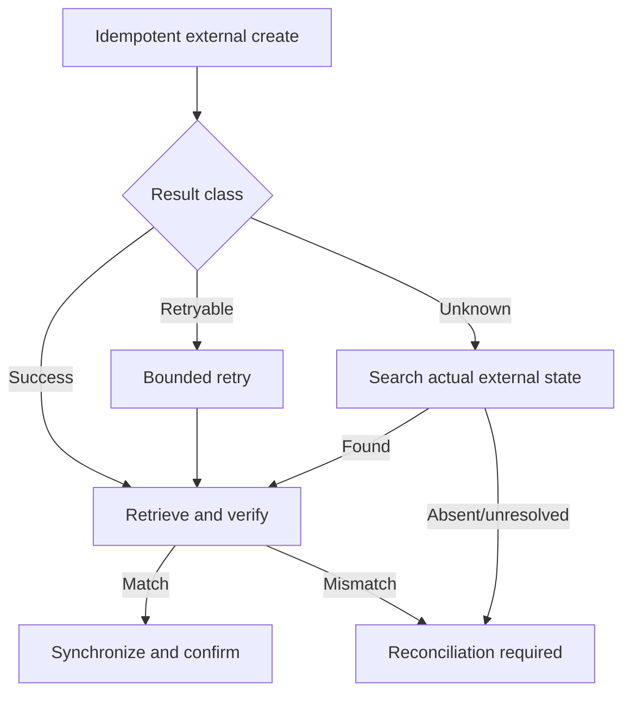

# Healthcare-System Integration and Recovery

## Connector contract

`MockEHRConnector` hides HTTP details and returns a vendor-neutral `ConnectorResult` with a classification, data and safe message. Its operations cover patient, provider, facility, department and calendar lookup; availability; appointment create/update/reschedule/cancel/retrieve/search; and verification.

Replacing the Mock EHR requires a new adapter with the same semantic operations. Conversation and scheduling code do not change.

## Mappings

Successful booking stores internal-to-external mappings for patient, provider, facility, calendar and appointment. The appointment also stores its external identifier for direct lifecycle operations. Mapping creation is unique per connection/entity/internal identifier.

## Verified booking algorithm

1. Validate the real internal slot against calendar, working hours, blocks and reservations.
2. Resolve required patient/provider/facility/calendar external mappings.
3. Persist the internal request, exclusive slot reservation, history and integration operation.
4. Send an idempotent external create.
5. Classify the response.
6. On a known retryable response, retry up to the configured prototype bound.
7. On an unknown outcome, search exact external attributes before any retry.
8. Retrieve the external appointment and compare patient, provider, date, time and status.
9. Synchronize internal state to confirmed only after a complete match.
10. Otherwise create a reconciliation record and return a pending outcome.



## Failure simulation

```bash
# Normal
curl -X POST 'http://localhost:9000/ehr/simulation?failure=false&unknown=false'

# Retryable outage: appointment is not created
curl -X POST 'http://localhost:9000/ehr/simulation?failure=true&unknown=false'

# Unknown outcome: appointment is created but response is lost
curl -X POST 'http://localhost:9000/ehr/simulation?failure=false&unknown=true'
```

In Compose, port 9000 is internal by default; run the curl from the network or temporarily publish it. The unknown-outcome demonstration must show one external record, a search recovery, successful verification and no duplicate.

## Reconciliation

Unresolved operations create a durable record linked to hospital, integration operation and appointment. Authorized operations views expose the queue. Resolution records an operator decision and synchronizes the appointment to an allowed final state. Correlation IDs connect the appointment, capability, integration, verification, workflow and notification trail.
