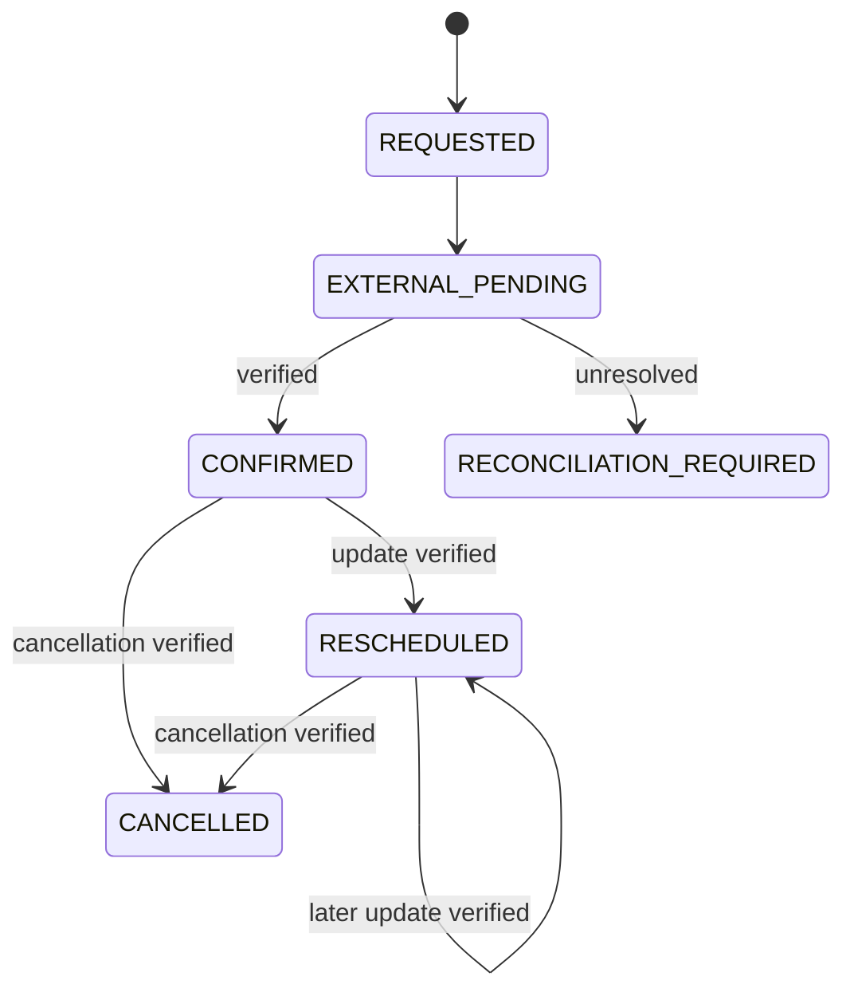

# Low-Level Design

## Package design

| Module | Contract |
|---|---|
| `config` | Immutable environment-derived settings |
| `db` | Engine, session lifecycle and declarative base |
| `models` | Durable entities, ownership fields, constraints and indexes |
| `schemas` | Strict input validation; unknown fields rejected |
| `security` | Password hashing, signed tokens, role dependencies and tenant context |
| `scheduling` | Candidate generation and immediate slot validation |
| `idempotency` | Operation/key/payload hash begin and response replay |
| `connectors` | `ConnectorResult` classification and Mock EHR operations |
| `appointments` | Booking/reschedule/cancel state machines and synchronization |
| `capabilities` | Only action surface available to the AI |
| `agent_runtime` | Intent/context/prompting; contains no vendor EHR code |
| `workflows` | Durable execution queue, delays, steps and retry/backoff |
| `notifications` | Idempotent Resend delivery and webhook status updates |
| `telemetry` | Audit, capability and operational event persistence |
| `api` | Authorization-aware use-case endpoints |

## State separation

| State class | Examples | Tables |
|---|---|---|
| Transactional | appointment status and history | `appointments`, `appointment_history`, `slot_reservations` |
| Conversational | intent, selected doctor/slot/appointment | `ai_conversations`, `ai_contexts` |
| User context | communication/preference values | `patients`, `user_preferences` |
| Workflow | queued/current step/retry/completion | `workflows`, `workflow_executions` |
| Integration | request attempts, verification and mapping | `integration_operations`, `integration_verifications`, `external_identifier_mappings` |
| Operational | reconciliation, escalation, audit and traces | `reconciliation_records`, `human_escalations`, `audit_events`, `operational_events` |

## Appointment state rules

Each transition appends history. Confirmation is impossible before a successful external read verification. Reschedule reserves the new slot, verifies the external state, updates internal times, and releases the old slot. Cancel verifies the external cancelled state and releases its reservation.

## Error classification

| Condition | Classification/action |
|---|---|
| HTTP 429/5xx, connection failure | Retryable, bounded to three create attempts |
| Timeout/lost response | Unknown outcome; search exact patient/provider/date/time before retry |
| 401/403/4xx validation | Non-retryable |
| Successful response with differing record | Verification mismatch |
| Unresolved after policy | `RECONCILIATION_REQUIRED`, HTTP 202 |

## AI action protocol

1. Load or create patient-owned conversation/context.
2. Apply urgent-language and prohibited-clinical safety policies.
3. Resolve supported administrative intent and references from context.
4. Ask a clarification when the appointment, doctor, date, slot or response is ambiguous.
5. Invoke a typed `CapabilityRunner` method.
6. Require confirmation before create/cancel/reschedule.
7. Persist capability outcome and correlated operational events.
8. State only verified appointment outcomes.

## Questionnaire validation

Supported types are yes/no, choice, multiple choice, numeric with bounds, date, short/long text, and structured objects. A response must belong to the assignment’s approved questionnaire. Required answers gate completion. The conversational and form paths store the same typed response records.

## Workflow execution

An event and appointment produce a unique workflow event key. An execution can be waiting, pending, running, retrying, completed or failed. `available_at` implements delays and retry backoff. Step-level notification keys prevent duplicates. The seeded confirmed-appointment workflow assigns a matching questionnaire and sends a confirmation email.

## API conventions

- Prefix: `/api/v1`
- Bearer access tokens for protected operations
- `x-correlation-id` accepted or generated and returned
- Structured errors: `detail.code` and `detail.message`
- 404 concealment for cross-tenant resources
- 409 for conflicts/idempotency misuse
- 422 for schema/domain validation
- 202 for unresolved external outcomes
